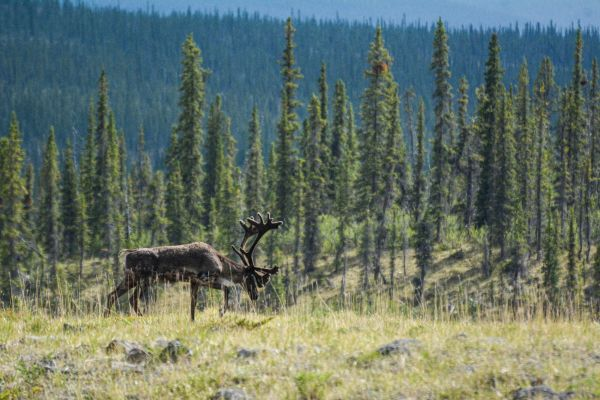
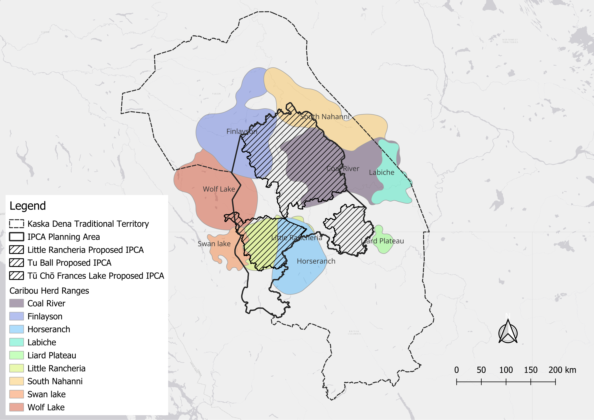

# Caribou Analysis and Modelling
### Seasonal movements, habitat selection, and landscape connectivity

BEACONs Project
2025-12-30

# Introduction

The objective of this report is to analyse movement patterns, habitat use, and functional connectivity of caribou herds intersecting the Liard First Nations (LFN) traditional territory in southeast Yukon and northcentral BC. Products will include i) a detailed report describing methods and results (this document), ii) a set of maps identifying seasonal ranges, movement corridors and habitat suitability, and iii) online apps and dashboards allowing users to further explore the results of the analyses. This is a live document that will be revised regularly as the analysis proceeds and based on feedback from collaborators.

## Caribou

Caribou play an important role for LFN, serving as a keystone species in local ecosystems and having cultural significance for Indigenous communities. Ecologically, caribou contribute to the health of boreal forests by influencing vegetation patterns and providing food for predators. Culturally, caribou provide food, materials for clothing and tools, and are a central part of local traditions and knowledge. Consequently, the conservation of their seasonal ranges, including winter foraging grounds and summer calving and grazing areas, is important for the health and long-term persistence of the population. However, these habitats are increasingly threatened by human activities and disturbances, particularly large-scale resource development like mining, which leads to habitat fragmentation and landscape alteration.

The establishment of Indigenous Protected and Conserved Areas (IPCAs) and other protected lands are important tools for ensuring the long-term survival of caribou populations, as they allow for the management of these threats. These areas enable collaborative stewardship, respect traditional ecological knowledge, and support sustainable use, thus contributing to the persistence of caribou and their habitats. By prioritizing both ecological integrity and cultural continuity, IPCAs can thus strengthen conservation and sustainable land management now and in the future. As part of this project, we will evaluate the contribution of the proposed IPCAs to seasonal movements, habitat selection, and landscape connectivity.

### Northern mountain caribou

There are 26 herds of Northern Mountain caribou in Yukon occupying most of the south and central regions (Environment Yukon 2016). Nine of the herds intersect the LFN area of interest (Figure 1), with four herds crossing over into British Columbia (Swan Lake, Little Rancheria, Horseranch, and Liard Plateau). Each herd is managed based on its unique range and population characteristics (Ref). Population monitoring relies on aerial surveys and long-term data to assess herd status, recruitment (calf survival), and sex ratios.

**Figure 1**. Distribution Northern Mountain Caribou herds intersecting the LFN area of interest.

Table 1 summarizes the status of the nine Northern Mountain Caribou herds that intersect the the LFN traditional territory, providing a snapshot of their population health and monitoring status. Population estimates range widely, from the smallest herd, Liard Plateau (151 individuals surveyed in 2011), to the largest, Finlayson (3,359 individuals surveyed in 2022). Monitoring effort is inconsistent; while some herds like Coal River, Finlayson, Little Rancheria, and Wolf Lake were recently surveyed (2021-2022), others, including Horseranch, Labiche, Liard Plateau, and South Nahanni, have not been surveyed in over a decade, leaving their population trends "Unknown." Of the recently monitored herds, Finlayson, Swan Lake, and Wolf Lake are considered "Stable" or "Stable/Increasing," while Coal River is "Decreasing/Stable" and Little Rancheria is "Likely declining," highlighting varying levels of conservation concern across the region.

**Table 1**. Status of woodland caribou herd populations in Yukon (Ref).

| Herd                         | Population Estimate | Last Surveyed |       Trend       |
| :--------------------------- | :-----------------: | :-----------: | :---------------: |
| Coal River                   |        1,203        |     2022      | Decreasing/Stable |
| Finlayson                    |        3,359        |     2022      | Stable/Increasing |
| Horseranch                   |         600         |     1999      |      Unknown      |
| Little Rancheria1 |         742         |     2022      | Likely declining  |
| Labiche                      |         450         |     1993      |      Unknown      |
| Liard Plateau                |         151         |     2011      |      Unknown      |
| South Nahanni                |        2,105        |     2009      |      Unknown      |
| Swan Lake                    |         702         |     2021      |      Stable       |
| Wolf Lake                    |        1,184        |     2022      |      Stable       |

1 Little Rancheria Caribou Population Estimate 2022 (Ref?)
